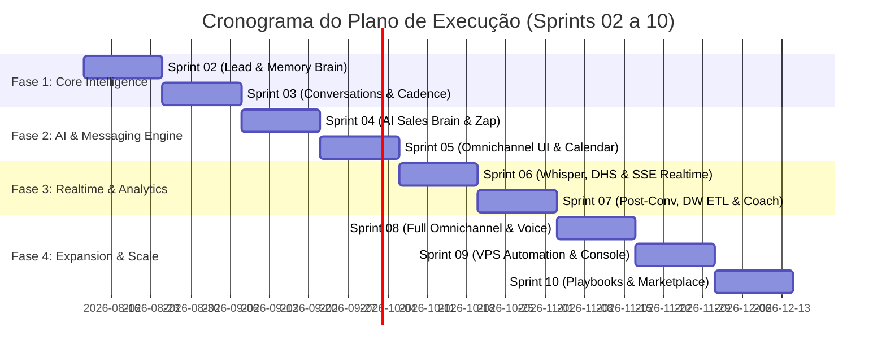

# PLAN_OF_EXECUTION.md — Plan of Execution for Revenue SDR OS Coding Phase

> **Documento Guia de Execução Técnica & Gestão Ágil (Sprints 02 a 10)**
> **Versão:** 3.0.0 | **Data:** 2026-08-10
> **Projeto Trello Kanban:** [Revenue SDR OS Board](https://trello.com/b/OH7UtbIQ/revenue-sdr-os)
> **Repositórios de Referência:** `00_SDR_architecture`, `01_SDR_Prototype`, `02_ZAP_Prototype`

---

## 1. Sumário Executivo & Alinhamento Estratégico

O **Revenue SDR OS** é um Sistema Operacional de Vendas Multi-Tenant orientado a conversas e orquestrado por Agentes de Inteligência Artificial. Diferente de CRMs tradicionais centrados em cadastros ou disparadores de mensagens estáticos, o produto coloca a **Conversa e a Memória do Relacionamento** como entidades primárias do sistema.

### Estado Atual do Projeto (Baseline v0.2.0):
- **Fundação Técnica (Sprint 01)**: **CONCLUÍDA** (Reescrita profissional v0.2.0, 57 testes automatizados de isolamento multi-tenant verdes, auth dupla Cookie HttpOnly + Bearer Argon2id/PyJWT, Alembic migrations em Batch Mode, middleware ASGI Zero-Trust).
- **Protótipos de Alta Fidelidade (Sprints 00-01.5)**: **CONCLUÍDOS** (`01_SDR_Prototype` — SDR Command Center & Theme Studio; `02_ZAP_Prototype` — Standalone Zap Copilot Micro-App com Auto-Sync Background).
- **Próximo Passo Inegociável**: **Início da Fase de Codificação do Produto Real (Sprint 02 — Lead Brain & Memory Brain)**.

---

## 2. Invariantes Arquiteturais & Guardiões de Engenharia (ADRs 001–029)

Todas as tarefas do backlog e códigos produzidos pela equipe de desenvolvimento (humanos ou Agentes de IA) devem obrigatoriamente respeitar as seguintes regras invioláveis:

```
                                  FLUXO DE REQUISIÇÃO ZERO-TRUST
 Request 
    │
    ▼
[ SecurityHeadersMiddleware ] ──▶ Headers de segurança + CSP
    │
    ▼
[ TenantResolutionMiddleware ] ──▶ ASGI Puro; seta request.state.organization + ContextVar current_organization
    │
    ▼
[ RateLimitingMiddleware ]   ──▶ Proteção por Tenant/IP (Valkey / Redis / DiskCache)
    │
    ▼
[ Router (Fino) ]           ──▶ Validação nos Pydantic Schemas (NÃO nos SQLModels table=True)
    │
    ▼
[ Service Layer ]           ──▶ Regras de Negócio; Queries obrigatoriamente filtradas por organization_id
    │
    ▼
[ Model (SQLModel) ]        ──▶ TenantMixin (organization_id FK NOT NULL) + TimestampMixin (UTC)
```

### Regras Invioláveis de Codificação:
1. **Padrão de Camadas Estrito**: Rota Fina (`router.py`) $\rightarrow$ Serviço de Negócio (`service.py`) $\rightarrow$ Modelo de Dados (`model.py`). Nenhuma query SQL ou lógica de IA pode residir diretamente nos routers.
2. **Defesa em Profundidade Multi-Tenant (Zero-Trust)**:
   - Toda query deve obrigatoriamente incluir `.where(Model.organization_id == current_organization.get().id)`.
   - Tentativas de acesso cross-tenant devem retornar **404 Not Found genérico** (nunca 403 Forbidden), evitando o vazamento da existência de dados entre clientes (ADR-018).
3. **Migrações de Banco com Alembic Batch Mode**: Nenhuma alteração de schema ocorre via `create_all()`. Migrações usam obrigatoriamente `render_as_batch=True` para compatibilidade total com Turso/libSQL (ADR-024).
4. **Resiliência e Idempotência de Jobs (Taskiq)**: Webhooks respondem `HTTP 202 Accepted` em $< 50\text{ ms}$. O processamento pesado de LLMs/Whisper roda assincronamente em workers do Taskiq com `job_key` para deduplicação (ADR-021).
5. **Orquestração Multi-Agente (LangGraph + LangChain)**: Fluxos de IA usam `StateGraph` com suporte a `interrupt()` para handoff humano (Copilot Mode no Zap) e fallback declarativo `with_fallbacks()` (Gemini/Sonnet $\rightarrow$ GPT-4o-mini) em timeouts $> 2.5\text{s}$ (ADR-023, ADR-027, ADR-028).
6. **Harness de Qualidade Obrigatório (ADR-026)**: Nenhum PR ou commit é aceito sem aprovação no pipeline de verificação: `pytest` (100% de isolamento tenant, $> 85\%$ de cobertura em services) + `ruff check` + `alembic` round-trip.

---

## 3. Matriz de Execução Ágil por Sprint (Sprints 02 a 10)



---

## 4. Detalhamento de Sprints & User Stories do Plan of Execution

---

### 🟢 SPRINT 02 — Lead Brain + Memory Brain (Início do Produto Real)
**Foco**: Ingestão de leads, unificação de identidades cross-channel, memórias estruturadas de longo prazo e linha do tempo de eventos append-only.

#### T1. Model & Service do Lead Brain (`app/models/lead.py`, `app/services/lead_service.py`)
- **User Story**: *Como SDR ou sistema de ingestão, quero cadastrar e atualizar leads associados estritamente à minha organização, para que o histórico de contatos seja isolado e persistido.*
- **Critérios de Aceite**:
  - Tabela `leads` criada com `organization_id` FK NOT NULL, `email`, `phone`, `document` (CNPJ/CPF), `score` (default 0), `stage_id`.
  - Índice composto único `uq_leads_org_phone` e `uq_leads_org_email`.
  - Serviço implementa `create_lead`, `get_lead`, `list_leads` com filtro mandatório por tenant.
  - Teste automatizado garante erro 404 ao tentar buscar lead de outro tenant.
- **Pontos de História**: 5 SP | **Prioridade**: P0 (Must)

#### T2. Resolução e Merge de Identidades Cross-Channel
- **User Story**: *Como sistema, quero identificar se um contato vindo do Zap ou Instagram já possui cadastro por e-mail ou telefone, mesclando suas identidades sem duplicar dados.*
- **Critérios de Aceite**:
  - Função `resolve_or_create_lead` verifica correspondência em `phone`, `email` ou `document`.
  - Caso haja match, dispara o evento `lead.merged` na timeline e atualiza dados secundários.
- **Pontos de História**: 5 SP | **Prioridade**: P0 (Must)

#### T3. Memory Brain — Tabela e Extrator de Memórias Estruturadas (`app/models/memory.py`)
- **User Story**: *Como IA Sales SDR, quero armazenar e consultar fatos de longo prazo sobre o lead (orçamento, objeções prévias, decisores, datas festivas), para personalizar diálogos futuros.*
- **Critérios de Aceite**:
  - Tabela `lead_memories` com `organization_id`, `lead_id`, `key` (ex: `budget_limit`), `value`, `confidence_score` (0.0–1.0), `source_channel`.
  - Suporte a busca vetorial leve via `sqlite-vec` local (Hot RAG $< 15\text{ ms}$).
- **Pontos de História**: 8 SP | **Prioridade**: P0 (Must)

#### T4. Lead Timeline Events Append-Only (`app/models/lead_event.py`)
- **User Story**: *Como gestor comercial, quero uma linha do tempo imutável de todas as interações do lead, para auditar e alimentar algoritmos de inteligência.*
- **Critérios de Aceite**:
  - Tabela `lead_timeline_events` append-only (sem UPDATE/DELETE).
  - Emite eventos: `lead.created`, `lead.stage_changed`, `lead.score_updated`, `memory.added`.
- **Pontos de História**: 5 SP | **Prioridade**: P0 (Must)

#### T5. UI de Pipeline Kanban & Detalhe do Lead (`01_SDR_Prototype` Integration)
- **User Story**: *Como gestor de vendas, quero visualizar o Kanban de leads em 5 estágios com filtragem dinâmica por tag e score, para priorizar os contatos de maior valor.*
- **Critérios de Aceite**:
  - Renderização Jinja2 + HTMX da lista de leads e modal de detalhe com timeline imutável.
  - Fidelidade total com a UI de `01_SDR_Prototype/index.html`.
- **Pontos de História**: 8 SP | **Prioridade**: P1 (Should)

---

### 🟡 SPRINT 03 — Conversations, Opportunity Brain & Cadence Engine
**Foco**: Modelo de agregados de conversas, scoring baseado em eventos e máquina de estados para cadências de relacionamento.

#### T6. Aggregate Root de Conversas e Mensagens (`app/models/conversation.py`)
- **User Story**: *Como sistema, quero registrar conversas como agregados raiz onde o lead é participante, indexando todas as mensagens recebidas e enviadas.*
- **Critérios de Aceite**:
  - Tabelas `conversations` e `messages` vinculadas à `organization_id`.
  - Suporte a status de conversa (`active`, `waiting_human`, `closed`, `scheduled`).
- **Pontos de História**: 8 SP | **Prioridade**: P0 (Must)

#### T7. Opportunity Brain — Scoring Baseado em Eventos
- **User Story**: *Como SDR, quero que cada ação do lead (responder rápido +5, perguntar preço +25, parar de responder -10) altere seu score automaticamente.*
- **Critérios de Aceite**:
  - Motor de regras avalia eventos append-only e recalcula o `lead.score`.
  - Gatilho automático de transição de estágio para `SQL (Sales Qualified Lead)` quando score $\ge 80$.
- **Pontos de História**: 5 SP | **Prioridade**: P1 (Should)

#### T8. Cadence Engine — Máquina de Estados e Agendador de Follow-up (Taskiq)
- **User Story**: *Como gestor, quero definir réguas de relacionamento automáticas por temperatura do lead, garantindo que nenhum contato fique sem resposta.*
- **Critérios de Aceite**:
  - Definição de cadências em JSON com passos (`wait_hours`, `action`, `channel`).
  - Worker Taskiq processa e executa os passos agendados de forma idempotente via `job_key`.
- **Pontos de História**: 8 SP | **Prioridade**: P0 (Must)

---

### 🔵 SPRINT 04 — AI Sales Brain & Z-API Zap Integration (LangChain & LangGraph Engine)
**Foco**: Orquestração multi-agente com LangGraph, integração de webhooks Z-API WhatsApp e Copilot Mode no Zap Micro-App.

#### T9. Z-API WhatsApp Webhook & Outbound Queue (`app/services/zap_service.py`)
- **User Story**: *Como sistema, quero receber mensagens do WhatsApp via Z-API em $< 50\text{ ms}$ e enfileirar o processamento da IA, para não estourar timeouts de webhook.*
- **Critérios de Aceite**:
  - Endpoint `/api/v1/webhooks/zapi` responde `HTTP 202 Accepted` instantaneamente.
  - Job Taskiq processa a mensagem inbound e despacha respostas outbound com retentativas (ADR-021).
- **Pontos de História**: 8 SP | **Prioridade**: P0 (Must)

#### T10. LangGraph StateGraph SDR Agent & Tool Calling (`app/agents/sdr_agent.py`)
- **User Story**: *Como SDR Virtual de IA, quero dialogar no WhatsApp consultando o RAG de playbooks, salvando memórias do lead e agendando reuniões.*
- **Critérios de Aceite**:
  - Orquestrador construído com `langgraph.StateGraph` e checkpointer de memória por conversa.
  - Ferramentas `@tool`: `search_product_rag`, `save_lead_memory`, `check_calendar_availability`.
  - Router de fallback `with_fallbacks()`: Gemini 2.5 Flash / Sonnet 3.5 $\rightarrow$ GPT-4o-mini em erro/timeout $> 2.5\text{s}$ (ADR-023, ADR-027).
- **Pontos de História**: 13 SP | **Prioridade**: P0 (Must)

#### T11. Integração do Standalone Zap Micro-App (`02_ZAP_Prototype`)
- **User Story**: *Como vendedor humano, quero alternar entre o modo Copilot Active e Human Mode na interface do Zap, recebendo sugestões RAG e visualizando o gráfico DHS em tempo real.*
- **Critérios de Aceite**:
  - Conexão do backend FastAPI aos endpoints consumidos pelo protótipo `02_ZAP_Prototype`.
  - Alternância de modo via `interrupt()` do LangGraph para pausar a execução da IA e liberar o controle ao humano (ADR-028).
- **Pontos de História**: 8 SP | **Prioridade**: P0 (Must)

---

### 🟣 SPRINT 05 — Monitoramento, Handoff IA<->Humano & Google Calendar
**Foco**: Preservação de contexto na transição de atendimento, sincronização bidirecional do Google Calendar e telemetria.

#### T12. Protocolo de Handoff com Resumo de Contexto por IA
- **User Story**: *Como vendedor assumindo um atendimento, quero receber um resumo instantâneo da conversa e das objeções do lead gerado pela IA, para intervir sem ler centenas de mensagens.*
- **Critérios de Aceite**:
  - Ao mudar o status para `waiting_human`, o serviço gera um card de briefing sintético no topo do chat.
- **Pontos de História**: 5 SP | **Prioridade**: P1 (Should)

#### T13. Google Calendar Integration via LangChain Tool
- **User Story**: *Como SDR Virtual, quero consultar horários livres e criar eventos no Google Calendar do vendedor durante a conversa, convertendo a qualificação em reunião agendada.*
- **Critérios de Aceite**:
  - Integração OAuth2 por tenant e execução limpa da ferramenta `@tool` no grafo do LangGraph.
- **Pontos de História**: 8 SP | **Prioridade**: P1 (Should)

---

### 🟠 SPRINT 06 — Transcrição Whisper, Realtime DHS & Engine SSE Streaming
**Foco**: Processamento de áudio do WhatsApp, métricas ao vivo de sentimento (DHS) e canal Server-Sent Events.

#### T14. Engine de Server-Sent Events (SSE) Multi-Tenant (`app/core/sse.py`)
- **User Story**: *Como operador de vendas, quero ver novas mensagens, alertas de DHS e eventos da IA surgindo na tela em tempo real sem atualizar a página.*
- **Critérios de Aceite**:
  - Broker SSE in-memory via `sse-starlette` transmitindo eventos isolados por `organization_id` (ADR-005).
- **Pontos de História**: 8 SP | **Prioridade**: P0 (Must)

#### T15. Transcrição de Áudio com OpenAI Whisper & Ingestão RAG
- **User Story**: *Como sistema, quero transcrever notas de áudio enviadas pelo lead no Zap em $< 1.5\text{s}$, exibindo o texto no chat e alimentando o extrator de memórias.*
- **Critérios de Aceite**:
  - Worker Taskiq baixa a mídia do WhatsApp, executa a transcrição Whisper e injeta o texto na timeline.
- **Pontos de História**: 8 SP | **Prioridade**: P0 (Must)

#### T16. Cálculo Dinâmico do DHS Score (Health of Deal Chart.js)
- **User Story**: *Como gestor, quero acompanhar a evolução da saúde da negociação (0 a 100) refletida no gráfico Chart.js do Zap Micro-App.*
- **Critérios de Aceite**:
  - Avaliação de sentimento e intenção de compra gera atualizações do DHS transmitidas via SSE.
- **Pontos de História**: 5 SP | **Prioridade**: P1 (Should)

---

### 🔴 SPRINT 07 — Pós-Conversa, Dashboards Analíticos & Data Tiering (ADR-015)
**Foco**: Pipeline ETL/CDC para Data Warehouse (PostgreSQL/Supabase), arquivamento de dados e inteligência do Manager Brain.

#### T17. Pipeline de Storage Tiering (Hot Turso Local $\rightarrow$ Cold Postgres DW)
- **User Story**: *Como engenheiro de dados, quero mover conversas consolidadas com mais de 30 dias do Turso local para o Postgres/Supabase central, mantendo o banco local leve.*
- **Critérios de Aceite**:
  - Cron job assíncrono (D-1) copia histórico para o DW com `pgvector` e aplica expurgo seguro no Turso local (ADR-015).
- **Pontos de História**: 8 SP | **Prioridade**: P0 (Must)

#### T18. Dashboards Analíticos do Manager Brain (`01_SDR_Prototype` Integration)
- **User Story**: *Como dono do negócio, quero visualizar indicadores de Funil, CAC, ROI, Canal Vencedor e Performance da IA no Command Center.*
- **Critérios de Aceite**:
  - Endpoints de agregados lendo dados quentes e frios para renderizar os cards de métricas do protótipo `01_SDR_Prototype`.
- **Pontos de História**: 8 SP | **Prioridade**: P1 (Should)

#### T19. AI Coach SDR Pós-Conversa
- **User Story**: *Como coordenador de vendas, quero que a IA analise atendimentos concluídos por vendedores humanos e gere relatórios de feedback (pontos fortes e melhorias).*
- **Critérios de Aceite**:
  - Job batch com Instructor/Pydantic gera relatório estruturado de coaching pós-conversa.
- **Pontos de História**: 5 SP | **Prioridade**: P2 (Could)

---

### 🟤 SPRINT 08 — Omnichannel Completo (Instagram DM, E-mail & Voice)
**Foco**: Expansão para múltiplos canais mantendo a continuidade do relacionamento no Lead Brain.

#### T20. Ingestão de Instagram Direct Messages & E-mail Inbox
- **User Story**: *Como cliente, quero iniciar uma conversa no Instagram DM e continuá-la no WhatsApp sem perder o contexto.*
- **Critérios de Aceite**:
  - Drivers de canal para Instagram Graph API e IMAP/SMTP vinculados à máquina de cadência.
- **Pontos de História**: 13 SP | **Prioridade**: P1 (Should)

---

### ⚪ SPRINT 09 — VPS Dedicada Automatizada & Update Orchestrator (ADR-004)
**Foco**: Orquestração da arquitetura On-Premise-as-a-Service, Platform Console (MyraOS) e Update Agent via systemd.

#### T21. Systemd Update Agent com Rollback Automático
- **User Story**: *Como operador da plataforma, quero que cada VPS cliente faça pull de atualizações a cada 6h com rollback automático em caso de falha de teste/healthcheck.*
- **Critérios de Aceite**:
  - Script e serviço systemd validam a saúde da aplicação pós-update e revertem para o commit anterior se houver erro HTTP 5xx.
- **Pontos de História**: 13 SP | **Prioridade**: P0 (Must)

---

### ⚪ SPRINT 10 — Playbooks Verticais & Marketplace de Agentes (Tribo)
**Foco**: Customização por nicho (saúde, imobiliário, advocacia) e distribuição de agentes.

#### T22. Mecanismo de Importação de Playbooks Verticais & Marketplace
- **User Story**: *Como parceiro white-label, quero instalar pacotes de playbooks de vendas pré-configurados para o meu nicho de mercado.*
- **Critérios de Aceite**:
  - Parser e validador de pacotes JSON/YAML contendo prompts, ferramentas RAG e regras de cadência.
- **Pontos de História**: 8 SP | **Prioridade**: P2 (Could)

---

## 5. Matriz de Cobertura de Qualidade, DoD e DoR

### Definition of Ready (DoR):
- [x] User Story documentada no formato Padrão Ágil com contexto comercial claro.
- [x] Critérios de aceite especificados e alinhados às ADRs de arquitetura.
- [x] Estimativa em Story Points atribuída via Fibonacci (1, 2, 3, 5, 8, 13).
- [x] Dependências de banco/schema mapeadas com migração Alembic planejada.

### Definition of Done (DoD):
- [x] Código implementado seguindo o padrão `Model -> Service -> Schema -> Router`.
- [x] Filtro mandatório de `organization_id` aplicado via `ContextVar` em todas as queries.
- [x] Migração Alembic criada com `render_as_batch=True` e validada em round-trip (`upgrade -> downgrade -> upgrade`).
- [x] Testes de isolamento multi-tenant criados e passando (100% de sucesso).
- [x] Cobertura de testes unitários e de integração nos serviços $> 85\%$.
- [x] `ruff check` e `mypy` executados sem nenhum aviso ou erro.
- [x] Fidelidade visual verificada com os protótipos `01_SDR_Prototype` e `02_ZAP_Prototype`.

---

## 6. Especificação do Quadro Trello Kanban (Sincronização API / MCP)

Para refletir este Plano de Execução no quadro Trello [https://trello.com/b/OH7UtbIQ/revenue-sdr-os](https://trello.com/b/OH7UtbIQ/revenue-sdr-os), a estrutura de colunas e etiquetas deve ser organizada da seguinte forma:

### Estrutura de Listas (Colunas do Board):
1. `📚 Visão Geral & ADRs (Referências de Arquitetura)`
2. `📋 Product Backlog (Sprints 03 a 10)`
3. `🎯 Sprint Backlog (Sprint 02 — Lead & Memory Brain)`
4. `🚧 Em Desenvolvimento (WIP Limit: 3)`
5. `👀 Review & Validação Zero-Trust (QA)`
6. `🧪 Testes Automatizados & Test Harness`
7. `✅ Concluído (Sprints Delivered & v0.2.0 Baseline)`

### Sistema de Etiquetas (Labels):
- `[P0] Crítico / Must Have` (Vermelho)
- `[P1] Importante / Should Have` (Laranja)
- `[P2] Desejável / Could Have` (Amarelo)
- `Backend / FastAPI` (Azul)
- `Multi-Tenant Zero-Trust` (Roxo)
- `LangGraph / AI Agent` (Verde Escuro)
- `Frontend / HTMX / Alpine` (Verde Claro)
- `Database / Alembic / Turso` (Rosa)
- `Taskiq / Async Worker` (Sky)

---

*Este documento constitui o Guia Oficial de Execução Técnica do Revenue SDR OS e deve ser mantido como referência viva durante todas as sessões de desenvolvimento.*
