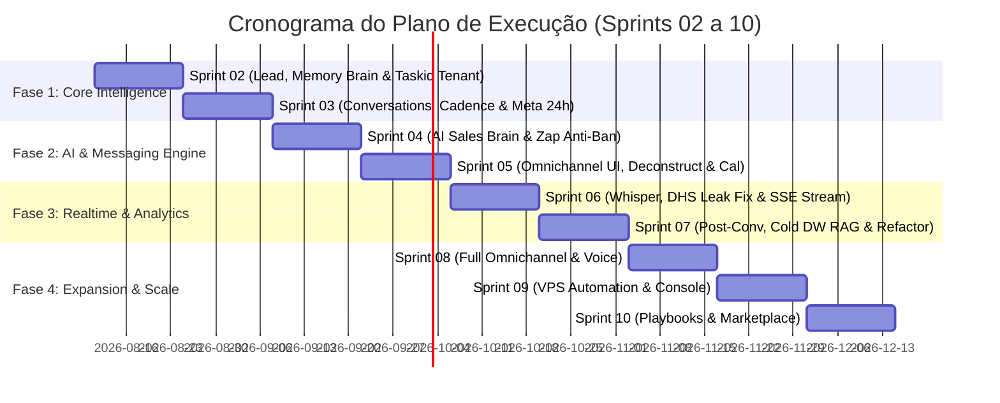

# PLAN_OF_EXECUTION.md — Plan of Execution for Revenue SDR OS Coding Phase

> **Documento Guia de Execução Técnica & Gestão Ágil (Sprints 02 a 10)**
> **Versão:** 3.0.0 | **Data:** 2026-08-10
> **Projeto Trello Kanban:** [Revenue SDR OS Board](https://trello.com/b/OH7UtbIQ/revenue-sdr-os)
> **Repositórios de Referência:** `00_SDR_architecture`, `01_SDR_Prototype`, `02_ZAP_Prototype`

---

## 1. Sumário Executivo & Alinhamento Estratégico

O **Revenue SDR OS** é um Sistema Operacional de Vendas Multi-Tenant orientado a conversas e orquestrado por Agentes de Inteligência Artificial. Diferente de CRMs tradicionais centrados em cadastros ou disparadores de mensagens estáticos, o produto coloca a **Conversa e a Memória do Relacionamento** como entidades primárias do sistema.

### Estado Atual do Projeto (Baseline v0.2.0):
- **Fundação Técnica (Sprint 01)**: **CONCLUÍDA** (Reescrita profissional v0.2.0, 57 testes automatizados de isolamento multi-tenant verdes, auth dupla Cookie HttpOnly + Bearer Argon2id/PyJWT, Alembic migrations em Batch Mode, middleware ASGI Zero-Trust).
- **Protótipos de Alta Fidelidade (Sprints 00-01.5)**: **CONCLUÍDOS** (`01_SDR_Prototype` — SDR Command Center & Theme Studio; `02_ZAP_Prototype` — Standalone Zap Copilot Micro-App com Auto-Sync Background).
- **Próximo Passo Inegociável**: **Início da Fase de Codificação do Produto Real (Sprint 02 — Lead, Memory Brain & Taskiq Tenant)**.

---

## 2. Invariantes Arquiteturais & Guardiões de Engenharia (ADRs 001–032)

Todas as tarefas do backlog e códigos produzidos pela equipe de desenvolvimento (humanos ou Agentes de IA) devem obrigatoriamente respeitar as seguintes regras invioláveis:

```
                                  FLUXO DE REQUISIÇÃO ZERO-TRUST
 Request 
    │
    ▼
[ SecurityHeadersMiddleware ] ──▶ Headers de segurança + CSP
    │
    ▼
[ TenantResolutionMiddleware ] ──▶ ASGI Puro; seta request.state.organization + ContextVar current_organization
    │
    ▼
[ RateLimitingMiddleware ]   ──▶ Proteção por Tenant/IP (Valkey / Redis / DiskCache)
    │
    ▼
[ Router (Fino) ]           ──▶ Validação nos Pydantic Schemas (NÃO nos SQLModels table=True)
    │
    ▼
[ Service Layer ]           ──▶ Regras de Negócio; Queries obrigatoriamente filtradas por organization_id
    │                          ├─▶ LeadService: Hook de Re-hidratação de Cold Storage (ADR-031)
    │                          └─▶ CadenceService: Validação de Janela de 24h Meta HSM (ADR-032)
    ▼
[ Taskiq Workers ]          ──▶ TenantTaskiqMiddleware serializa & hidrata ContextVar (ADR-030)
    │
    ▼
[ Model (SQLModel) ]        ──▶ TenantMixin (organization_id FK NOT NULL) + TimestampMixin (UTC)
```

### Regras Invioláveis de Codificação:
1. **Padrão de Camadas Estrito**: Rota Fina (`router.py`) $\rightarrow$ Serviço de Negócio (`service.py`) $\rightarrow$ Modelo de Dados (`model.py`). Nenhuma query SQL ou lógica de IA pode residir diretamente nos routers.
2. **Defesa em Profundidade Multi-Tenant (Zero-Trust)**:
   - Toda query deve obrigatoriamente incluir `.where(Model.organization_id == current_organization.get().id)`.
   - Tentativas de acesso cross-tenant devem retornar **404 Not Found genérico** (nunca 403 Forbidden), evitando o vazamento da existência de dados entre clientes (ADR-018).
3. **Propagação de Contexto em Workers Assíncronos (ADR-030)**:
   - Todo job do Taskiq deve obrigatoriamente utilizar o `TenantTaskiqMiddleware` (`app/tasks/middleware.py`).
   - O `pre_send` serializa o `organization_id` nos metadados da mensagem e o `pre_execute` hidrata a `ContextVar` `current_organization` no processo worker antes de executar a tarefa. Trabalhos executados sem tenant context lançam `RuntimeError` imediato.
4. **Protocolo de Re-hidratação de Contexto de Cold Storage (ADR-031)**:
   - Se um lead inativo (> 30 dias) enviar uma mensagem inbound, o `LeadService` aciona o hook de re-hidratação assíncrona para buscar o histórico relevante no Postgres Cold DW e recarregar as últimas 10 mensagens e memórias chave na réplica local Turso hot storage.
   - O modelo de embeddings em `sqlite-vec` (Turso local) e `pgvector` (Postgres DW) deve ser estritamente mantido idêntico (`text-embedding-3-small` 1536d) para prevenir incompatibilidade de busca vetorial.
5. **Enforcement da Janela Meta 24h & Anti-Ban no WhatsApp (ADR-032)**:
   - Toda mensagem outbound gerada por cadências automáticas deve validar o timestamp da última mensagem inbound do lead (`last_inbound_timestamp`). Se $> 24\text{ horas}$, a mensagem DEVE utilizar obrigatoriamente um modelo aprovado (HSM Template) ou sinalizar o operador no Zap Copilot.
   - Disparos no WhatsApp via Z-API/Evolution API devem aplicar limitadores por token-bucket com intervalos humanizados aleatórios (3–5s de pause, máximo de 200 disparos/dia em contas novas) para mitigar banimentos.
6. **SLA de Latência & Timeout Estrito de LLM (ADR-019, ADR-023)**:
   - O timeout da chamada LLM primária (`gemini-2.5-flash` / `claude-3.5-sonnet`) é limitado a no máximo **900 ms**.
   - Caso a primária falhe ou exceda 900ms, o router dispara o modelo secundário (`gpt-4o-mini`) com orçamento adicional de 900ms, garantindo teto acumulado de **1.8s**, de forma a preservar o SLA P95 do SDR Agent em **$< 1.2\text{ s}$**.
7. **Checkpointer Persistente & Escalonamento no LangGraph (ADR-028)**:
   - Substituição obrigatória de checkpointers efêmeros (`MemorySaver`) por checkpointer persistente baseado em banco local Turso/libSQL (`AsyncSqliteSaver`).
   - Estados de pausa em `interrupt()` (Human-in-the-Loop) sem interação humana por $> 15\text{ minutos}$ disparam automaticamente um job assíncrono Taskiq de escalonamento para o gestor comercial.
8. **Migrações de Banco com Alembic Batch Mode**: Nenhuma alteração de schema ocorre via `create_all()`. Migrações usam obrigatoriamente `render_as_batch=True` para compatibilidade total com Turso/libSQL (ADR-024).
9. **Sincronização Baseline do Repositório**: O diretório `revenue_sdr_os` deve ter seu mock legada `server.ts` (Node.js) completamente substituído pela aplicação oficial Python 3.12+ FastAPI (`app/main.py`), modelos SQLModel e estrutura modular alinhada à especificação da arquitetura.
10. **Harness de Qualidade Obrigatório (ADR-026)**: Nenhum PR ou commit é aceito sem aprovação no pipeline de verificação: `pytest` (100% de isolamento tenant, $> 85\%$ de cobertura em services) + `ruff check` + `alembic` round-trip.

---

## 3. Matriz de Execução Ágil por Sprint (Sprints 02 a 10)



---

## 4. Detalhamento de Sprints & User Stories do Plan of Execution

---

### 🟢 SPRINT 02 — Lead Brain + Memory Brain + Taskiq Tenant Propagation (Início do Produto Real)
**Foco**: Ingestão de leads, unificação de identidades cross-channel, memórias estruturadas de longo prazo, propagação de tenant em workers assíncronos e sincronização do baseline Python.

#### T1. Sincronização do Baseline Python `revenue_sdr_os` & App Factory (`app/main.py`)
- **User Story**: *Como desenvolvedor de plataforma, quero substituir o mock Node `server.ts` legado em `revenue_sdr_os` pelo app factory oficial Python 3.12+ FastAPI, para que o repositório de produção reflita fielmente a especificação arquitetural.*
- **Critérios de Aceite**:
  - Remoção de `server.ts` e arquivos Node legados de `revenue_sdr_os`.
  - Início da aplicação via `app/main.py` com FastAPI app factory, rotas modularizadas e suporte a Alembic batch mode.
- **Pontos de História**: 5 SP | **Prioridade**: P0 (Must)

#### T2. Implementation do TenantTaskiqMiddleware (`app/tasks/middleware.py`, `app/tasks/broker.py`) (ADR-030)
- **User Story**: *Como engenheiro de segurança, quero que todo job executado assincronamente pelo Taskiq propague a ContextVar `current_organization`, evitando execução descontextualizada ou vazamento de dados.*
- **Critérios de Aceite**:
  - Middleware `TenantTaskiqMiddleware` implementado e registrado no broker Taskiq.
  - `pre_send` insere `organization_id` nas labels da mensagem; `pre_execute` seta `current_organization` na thread/processo do worker.
  - Testes unitários confirmam exceção `RuntimeError` caso um job seja despachado sem tenant.
- **Pontos de História**: 5 SP | **Prioridade**: P0 (Must)

#### T3. Service Hook de Re-hidratação de Cold Storage (`app/services/lead_service.py`, `app/services/rehydration_service.py`) (ADR-031)
- **User Story**: *Como SDR Virtual de IA, quero re-hidratar o contexto e histórico de um lead inativo (> 30 dias) vindo do Cold Storage DW para a réplica local Turso, garantindo atendimento contextualizado a leads recorrentes.*
- **Critérios de Aceite**:
  - Hook em `LeadService.resolve_or_create_lead` verifica data do último contato. Se $> 30\text{ dias}$, chama `RehydrationService.fetch_cold_history`.
  - Baixa as últimas 10 mensagens e memórias essenciais do PostgreSQL DW para o Turso `.db` local.
- **Pontos de História**: 8 SP | **Prioridade**: P0 (Must)

#### T4. Model & Service do Lead Brain (`app/models/lead.py`, `app/services/lead_service.py`)
- **User Story**: *Como SDR ou sistema de ingestão, quero cadastrar e atualizar leads associados estritamente à minha organização, para que o histórico de contatos seja isolado e persistido.*
- **Critérios de Aceite**:
  - Tabela `leads` criada com `organization_id` FK NOT NULL, `email`, `phone`, `document` (CNPJ/CPF), `score` (default 0), `stage_id`.
  - Índice composto único `uq_leads_org_phone` e `uq_leads_org_email`.
  - Serviço implementa `create_lead`, `get_lead`, `list_leads` com filtro mandatório por tenant.
  - Teste automatizado garante erro 404 ao tentar buscar lead de outro tenant.
- **Pontos de História**: 5 SP | **Prioridade**: P0 (Must)

#### T5. Resolução e Merge de Identidades Cross-Channel
- **User Story**: *Como sistema, quero identificar se um contato vindo do Zap ou Instagram já possui cadastro por e-mail ou telefone, mesclando suas identidades sem duplicar dados.*
- **Critérios de Aceite**:
  - Função `resolve_or_create_lead` verifica correspondência em `phone`, `email` ou `document`.
  - Caso haja match, dispara o evento `lead.merged` na timeline e atualiza dados secundários.
- **Pontos de História**: 5 SP | **Prioridade**: P0 (Must)

#### T6. Memory Brain — Tabela e Extrator de Memórias Estruturadas (`app/models/memory.py`)
- **User Story**: *Como IA Sales SDR, quero armazenar e consultar fatos de longo prazo sobre o lead (orçamento, objeções prévias, decisores, datas festivas), para personalizar diálogos futuros.*
- **Critérios de Aceite**:
  - Tabela `lead_memories` com `organization_id`, `lead_id`, `key` (ex: `budget_limit`), `value`, `confidence_score` (0.0–1.0), `source_channel`.
  - Suporte a busca vetorial leve via `sqlite-vec` local (Hot RAG $< 15\text{ ms}$).
- **Pontos de História**: 8 SP | **Prioridade**: P0 (Must)

#### T7. Lead Timeline Events Append-Only (`app/models/lead_event.py`)
- **User Story**: *Como gestor comercial, quero uma linha do tempo imutável de todas as interações do lead, para auditar e alimentar algoritmos de inteligência.*
- **Critérios de Aceite**:
  - Tabela `lead_timeline_events` append-only (sem UPDATE/DELETE).
  - Emite eventos: `lead.created`, `lead.stage_changed`, `lead.score_updated`, `memory.added`.
- **Pontos de História**: 5 SP | **Prioridade**: P0 (Must)

---

### 🟡 SPRINT 03 — Conversations, Opportunity Brain & Cadence Engine com Meta 24h Window
**Foco**: Modelo de agregados de conversas, scoring baseado em eventos e máquina de estados para cadências com validação de Janela Meta 24h.

#### T8. Aggregate Root de Conversas e Mensagens (`app/models/conversation.py`)
- **User Story**: *Como sistema, quero registrar conversas como agregados raiz onde o lead é participante, indexando todas as mensagens recebidas e enviadas com UUIDs padronizados.*
- **Critérios de Aceite**:
  - Tabelas `conversations` e `messages` vinculadas à `organization_id`.
  - Suporte a status de conversa (`active`, `waiting_human`, `closed`, `scheduled`).
  - Ciclo de vida completo do status da mensagem (`queued`, `sent`, `delivered`, `read`, `failed`).
- **Pontos de História**: 8 SP | **Prioridade**: P0 (Must)

#### T9. Opportunity Brain — Scoring Baseado em Eventos
- **User Story**: *Como SDR, quero que cada ação do lead (responder rápido +5, perguntar preço +25, parar de responder -10) altere seu score automaticamente.*
- **Critérios de Aceite**:
  - Motor de regras avalia eventos append-only e recalcula o `lead.score`.
  - Gatilho automático de transição de estágio para `SQL (Sales Qualified Lead)` quando score $\ge 80$.
- **Pontos de História**: 5 SP | **Prioridade**: P1 (Should)

#### T10. Cadence Engine com Janela Meta 24h & Template HSM Enforcement (`app/services/cadence_service.py`) (ADR-032)
- **User Story**: *Como gestor, quero definir réguas de engajamento automáticas que respeitem rigorosamente a regra da Janela de 24 Horas do Meta WhatsApp, usando HSMs para mensagens ativas.*
- **Critérios de Aceite**:
  - Definição de cadências em JSON com passos (`wait_hours`, `action`, `channel`).
  - `CadenceService` verifica `last_inbound_timestamp`. Se $> 24\text{h}$, força o envio via Template HSM pré-aprovado ou gera alerta no Zap Copilot para aprovação manual.
  - Worker Taskiq processa e executa os passos agendados de forma idempotente via `job_key`.
- **Pontos de História**: 8 SP | **Prioridade**: P0 (Must)

---

### 🔵 SPRINT 04 — AI Sales Brain & Z-API WhatsApp com Anti-Ban & Persistent Checkpointer
**Foco**: Orquestração multi-agente com LangGraph, checkpointer persistente `AsyncSqliteSaver`, limitadores anti-ban por token-bucket e Copilot Mode.

#### T11. Z-API WhatsApp Ingest Webhook & Anti-Ban Rate Limiter (`app/services/zap_service.py`) (ADR-032)
- **User Story**: *Como sistema, quero receber webhooks do WhatsApp em $< 50\text{ ms}$ e enviar respostas outbound utilizando limitadores por token-bucket com retarda humanizada para evitar banimentos de número.*
- **Critérios de Aceite**:
  - Endpoint `/api/v1/webhooks/zapi` responde `HTTP 202 Accepted` instantaneamente.
  - `ZapService` aplica rate limiter token-bucket (max 1 msg a cada 3-5s com jitter aleatório e teto de 200 msgs/dia por nova conta).
- **Pontos de História**: 8 SP | **Prioridade**: P0 (Must)

#### T12. LangGraph StateGraph SDR Agent & Persistent AsyncSqliteSaver (`app/agents/sdr_agent.py`) (ADR-028)
- **User Story**: *Como SDR Virtual de IA, quero dialogar no WhatsApp consultando RAG, gravando memórias e mantendo o estado da conversa persistido em banco SQLite local.*
- **Critérios de Aceite**:
  - Orquestrador construído com `langgraph.StateGraph` utilizando checkpointer **`AsyncSqliteSaver`** conectado ao Turso `.db` (substituindo `MemorySaver`).
  - Ferramentas `@tool`: `search_product_rag`, `save_lead_memory`, `check_calendar_availability`.
  - Timeout do modelo primário cravado em **900 ms** (`gemini-2.5-flash` / `claude-3.5-sonnet`) com fallback `with_fallbacks()` (`gpt-4o-mini`) para garantir SLA P95 $< 1.2\text{ s}$.
- **Pontos de História**: 13 SP | **Prioridade**: P0 (Must)

#### T13. Escalonamento de Human-in-the-Loop & Integração Zap Micro-App (`02_ZAP_Prototype`)
- **User Story**: *Como vendedor humano, quero que conversas pausadas via `interrupt()` sem interação por 15 minutos sejam automaticamente escalonadas para a liderança comercial.*
- **Critérios de Aceite**:
  - Job assíncrono no Taskiq monitora thread checkpoints com estado `interrupt()` suspenso. Se decorridos 15 minutos sem resposta do vendedor, dispara notificação de escalonamento.
  - Integração perfeita dos endpoints FastAPI ao protótipo `02_ZAP_Prototype`.
- **Pontos de História**: 8 SP | **Prioridade**: P0 (Must)

---

### 🟣 SPRINT 05 — Frontend Refactoring `01_SDR_Prototype`, Handoff IA<->Humano & Calendar
**Foco**: Desconstrução do HTML monolítico de `01_SDR_Prototype` em Jinja2 templates + HTMX, protocolo de handoff e Google Calendar.

#### T14. Desconstrução do Monólito `01_SDR_Prototype` em Jinja2 Partial Templates (`app/web/templates/`)
- **User Story**: *Como engenheiro frontend, quero modularizar o arquivo monolithic `index.html` (1.1MB) de `01_SDR_Prototype` em templates Jinja2 e rotas HTMX para garantir manutenibilidade do Command Center.*
- **Critérios de Aceite**:
  - Separação em componentes Jinja2 reusáveis em `app/web/templates/components/`:
    - `sidebar.html`
    - `kanban_board.html`
    - `lead_detail_modal.html`
    - `theme_drawer.html`
  - Substituição de scripts estáticos inline por atributos HTMX (`hx-get`, `hx-target`, `hx-swap`) e controle fino via Alpine.js.
- **Pontos de História**: 8 SP | **Prioridade**: P0 (Must)

#### T15. Protocolo de Handoff com Resumo de Contexto por IA
- **User Story**: *Como vendedor assumindo um atendimento, quero receber um resumo instantâneo da conversa e das objeções do lead gerado pela IA, para intervir sem ler centenas de mensagens.*
- **Critérios de Aceite**:
  - Ao mudar o status para `waiting_human`, o serviço gera um card de briefing sintético no topo do chat.
- **Pontos de História**: 5 SP | **Prioridade**: P1 (Should)

#### T16. Google Calendar Integration via LangChain Tool
- **User Story**: *Como SDR Virtual, quero consultar horários livres e criar eventos no Google Calendar do vendedor durante a conversa, convertendo a qualificação em reunião agendada.*
- **Critérios de Aceite**:
  - Integração OAuth2 por tenant e execução limpa da ferramenta `@tool` no grafo do LangGraph.
- **Pontos de História**: 8 SP | **Prioridade**: P1 (Should)

---

### 🟠 SPRINT 06 — Refactoring `02_ZAP_Prototype`, Whisper Transcrição & SSE Realtime
**Foco**: Correção de memory leak no Chart.js e padronização UUID no `02_ZAP_Prototype`, transcrição Whisper e canal SSE.

#### T17. Refactoring do `02_ZAP_Prototype` (Chart.js Memory Leak Fix & Padronização UUIDv4)
- **User Story**: *Como desenvolvedor frontend, quero eliminar o vazamento de memória do Chart.js e padronizar os IDs de leads em UUIDv4 no micro-app Zap Copilot, garantindo estabilidade do navegador.*
- **Critérios de Aceite**:
  - Correção em `02_ZAP_Prototype/app.js`: trocar `new Chart()` ao alternar leads por mutação de dados `chartInstance.data.datasets[0].data = newScores; chartInstance.update()`.
  - Padronização de IDs de leads para strings UUIDv4 no store Alpine `$store.sdrApp`.
  - Mapeamento estrito das badges de modo ao enum `ConversationMode` (`copilot`, `autonomous`, `human`).
- **Pontos de História**: 5 SP | **Prioridade**: P0 (Must)

#### T18. Engine de Server-Sent Events (SSE) Multi-Tenant (`app/core/sse.py`)
- **User Story**: *Como operador de vendas, quero ver novas mensagens, alertas de DHS e eventos da IA surgindo na tela em tempo real sem atualizar a página.*
- **Critérios de Aceite**:
  - Broker SSE in-memory via `sse-starlette` transmitindo eventos isolados por `organization_id` (ADR-005).
- **Pontos de História**: 8 SP | **Prioridade**: P0 (Must)

#### T19. Transcrição de Áudio com OpenAI Whisper & Ingestão RAG
- **User Story**: *Como sistema, quero transcrever notas de áudio enviadas pelo lead no Zap em $< 1.5\text{s}$, exibindo o texto no chat e alimentando o extrator de memórias.*
- **Critérios de Aceite**:
  - Worker Taskiq baixa a mídia do WhatsApp, executa a transcrição Whisper e injeta o texto na timeline.
- **Pontos de História**: 8 SP | **Prioridade**: P0 (Must)

---

### 🔴 SPRINT 07 — Pós-Conversa, Dashboards Analíticos & Data Tiering (ADR-015, ADR-031)
**Foco**: Pipeline ETL/CDC para Data Warehouse (PostgreSQL/Supabase), arquivamento de dados e inteligência do Manager Brain.

#### T20. Pipeline de Storage Tiering & Re-hidratação (Hot Turso Local $\leftrightarrow$ Cold Postgres DW)
- **User Story**: *Como engenheiro de dados, quero mover conversas consolidadas com mais de 30 dias do Turso local para o Postgres DW, permitindo também a re-hidratação limpa de leads recorrentes.*
- **Critérios de Aceite**:
  - Cron job assíncrono (D-1) copia histórico para o DW com `pgvector` e aplica expurgo seguro no Turso local (ADR-015).
  - Teste de integração valida o fluxo de ida (arquivamento) e volta (`RehydrationService`, ADR-031).
- **Pontos de História**: 8 SP | **Prioridade**: P0 (Must)

#### T21. Dashboards Analíticos do Manager Brain (`01_SDR_Prototype` Integration)
- **User Story**: *Como dono do negócio, quero visualizar indicadores de Funil, CAC, ROI, Canal Vencedor e Performance da IA no Command Center.*
- **Critérios de Aceite**:
  - Endpoints de agregados lendo dados quentes e frios para renderizar os cards de métricas do protótipo `01_SDR_Prototype`.
- **Pontos de História**: 8 SP | **Prioridade**: P1 (Should)

#### T22. AI Coach SDR Pós-Conversa
- **User Story**: *Como coordenador de vendas, quero que a IA analise atendimentos concluídos por vendedores humanos e gere relatórios de feedback (pontos fortes e melhorias).*
- **Critérios de Aceite**:
  - Job batch com Instructor/Pydantic gera relatório estruturado de coaching pós-conversa.
- **Pontos de História**: 5 SP | **Prioridade**: P2 (Could)

---

### 🟤 SPRINT 08 — Omnichannel Completo (Instagram DM, E-mail & Voice)
**Foco**: Expansão para múltiplos canais mantendo a continuidade do relacionamento no Lead Brain.

#### T23. Ingestão de Instagram Direct Messages & E-mail Inbox
- **User Story**: *Como cliente, quero iniciar uma conversa no Instagram DM e continuá-la no WhatsApp sem perder o contexto.*
- **Critérios de Aceite**:
  - Drivers de canal para Instagram Graph API e IMAP/SMTP vinculados à máquina de cadência.
- **Pontos de História**: 13 SP | **Prioridade**: P1 (Should)

---

### ⚪ SPRINT 09 — VPS Dedicada Automatizada & Update Orchestrator (ADR-004)
**Foco**: Orquestração da arquitetura On-Premise-as-a-Service, Platform Console (MyraOS) e Update Agent via systemd.

#### T24. Systemd Update Agent com Rollback Automático
- **User Story**: *Como operador da plataforma, quero que cada VPS cliente faça pull de atualizações a cada 6h com rollback automático em caso de falha de teste/healthcheck.*
- **Critérios de Aceite**:
  - Script e serviço systemd validam a saúde da aplicação pós-update e revertem para o commit anterior se houver erro HTTP 5xx.
- **Pontos de História**: 13 SP | **Prioridade**: P0 (Must)

---

### ⚪ SPRINT 10 — Playbooks Verticais & Marketplace de Agentes (Tribo)
**Foco**: Customização por nicho (saúde, imobiliário, advocacia) e distribuição de agentes.

#### T25. Mecanismo de Importação de Playbooks Verticais & Marketplace
- **User Story**: *Como parceiro white-label, quero instalar pacotes de playbooks de vendas pré-configurados para o meu nicho de mercado.*
- **Critérios de Aceite**:
  - Parser e validador de pacotes JSON/YAML contendo prompts, ferramentas RAG e regras de cadência.
- **Pontos de História**: 8 SP | **Prioridade**: P2 (Could)

---

## 5. Matriz de Cobertura de Qualidade, DoD e DoR

### Definition of Ready (DoR):
- [x] User Story documentada no formato Padrão Ágil com contexto comercial claro.
- [x] Critérios de aceite especificados e alinhados às ADRs de arquitetura.
- [x] Estimativa em Story Points atribuída via Fibonacci (1, 2, 3, 5, 8, 13).
- [x] Dependências de banco/schema mapeadas com migração Alembic planejada.

### Definition of Done (DoD):
- [x] Código implementado seguindo o padrão `Model -> Service -> Schema -> Router`.
- [x] Filtro mandatório de `organization_id` aplicado via `ContextVar` em todas as queries.
- [x] Migração Alembic criada com `render_as_batch=True` e validada em round-trip (`upgrade -> downgrade -> upgrade`).
- [x] Testes de isolamento multi-tenant criados e passando (100% de sucesso).
- [x] Cobertura de testes unitários e de integração nos serviços $> 85\%$.
- [x] `ruff check` e `mypy` executados sem nenhum aviso ou erro.
- [x] Fidelidade visual verificada com os protótipos `01_SDR_Prototype` e `02_ZAP_Prototype`.

---

## 6. Especificação do Quadro Trello Kanban (Sincronização API / MCP)

Para refletir este Plano de Execução no quadro Trello [https://trello.com/b/OH7UtbIQ/revenue-sdr-os](https://trello.com/b/OH7UtbIQ/revenue-sdr-os), a estrutura de colunas e etiquetas deve ser organizada da seguinte forma:

### Estrutura de Listas (Colunas do Board):
1. `📚 Visão Geral & ADRs (Referências de Arquitetura)`
2. `📋 Product Backlog (Sprints 03 a 10)`
3. `🎯 Sprint Backlog (Sprint 02 — Lead & Memory Brain)`
4. `🚧 Em Desenvolvimento (WIP Limit: 3)`
5. `👀 Review & Validação Zero-Trust (QA)`
6. `🧪 Testes Automatizados & Test Harness`
7. `✅ Concluído (Sprints Delivered & v0.2.0 Baseline)`

### Sistema de Etiquetas (Labels):
- `[P0] Crítico / Must Have` (Vermelho)
- `[P1] Importante / Should Have` (Laranja)
- `[P2] Desejável / Could Have` (Amarelo)
- `Backend / FastAPI` (Azul)
- `Multi-Tenant Zero-Trust` (Roxo)
- `LangGraph / AI Agent` (Verde Escuro)
- `Frontend / HTMX / Alpine` (Verde Claro)
- `Database / Alembic / Turso` (Rosa)
- `Taskiq / Async Worker` (Sky)

---

*Este documento constitui o Guia Oficial de Execução Técnica do Revenue SDR OS e deve ser mantido como referência viva durante todas as sessões de desenvolvimento.*
