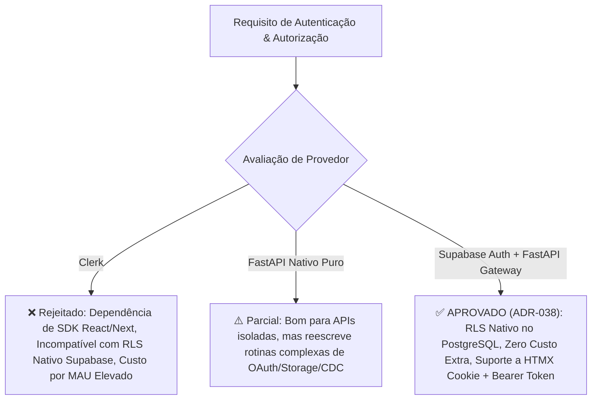
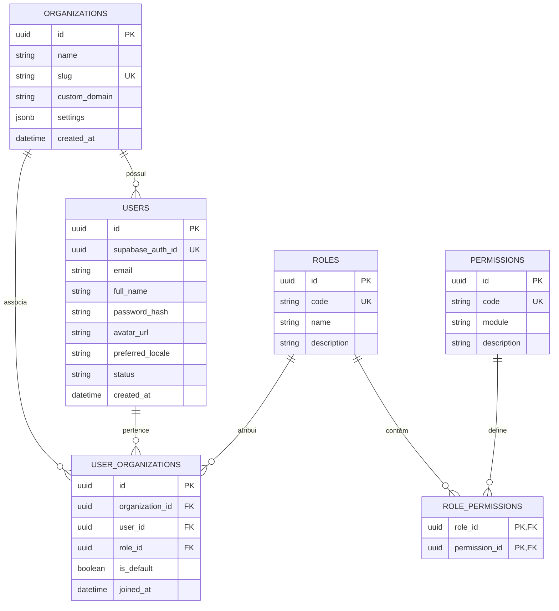
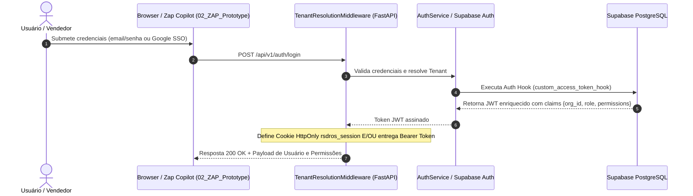

# Especificação Técnica de Autenticação e Autorização Multi-Tenant

> **Projeto:** Revenue SDR OS  
> **Status:** Aprovado (ADR-038)  
> **Versão:** v2.3.0  
> **Localização:** `00_SDR_architecture/docs/auth-and-authorization-spec.md`  

---

## 1. Visão Geral e Princípios de Arquitetura

O **Revenue SDR OS** exige um modelo de segurança robusto, resiliente e escalável que atenda aos requisitos de **Zero-Trust Multi-Tenancy (ADR-018)**, integração com o **PostgreSQL Unificado no Supabase (ADR-036 / ADR-037)** e perfeita sincronia com ambos os protótipos da plataforma:
- **`01_SDR_Prototype` (Admin OS)**: Dashboard administrativo, gestão de equipes, métricas de conversão e parametrização de playbooks de IA (SSR Jinja2/HTMX + Alpine.js).
- **`02_ZAP_Prototype` (Zap Copilot Micro-App)**: Interface standalone em grid 3 colunas para atendimento ao vivo no WhatsApp, controle de sugestões da IA e alternância de operador (SDR Humano vs Copilot IA).

---

## 2. Análise Comparativa Exaustiva: Supabase Auth vs. Clerk vs. FastAPI Nativo

A equipe de engenharia realizou um *brainstorming* técnico aprofundado avaliando as opções do mercado frente à arquitetura do Revenue SDR OS:



### Matriz Detalhada de Comparação Técnica

| Critério Avaliado | **Clerk (https://clerk.com/docs)** | **Supabase Auth (Escolha Aprovada)** | **FastAPI Auth Nativo Puro** |
|---|---|---|---|
| **Integração com Banco Supabase (ADR-037)** | Exige webhooks para sync de tabelas e assinatura customizada de JWTs para RLS. Riscos de inconsistência de estado. | **100% Nativo**: Integração direta com `auth.users`, `auth.uid()` e claims no PostgreSQL. | Requer injeção manual da ContextVar em todas as conexões e queries SQL. |
| **Arquitetura Frontend (Protótipos)** | Orientado majoritariamente a componentes React/Next.js. HTMX/Jinja2 exige wrappers JS complexos. | **Flexibilidade Total**: Transporte duplo via Cookie HttpOnly (`rsdros_session`) para HTMX e Token Bearer para micro-apps. | Suporta Cookie + Bearer, mas exige manutenção de toda infraestrutura de auth. |
| **Armazenamento de Mídias (Storage)** | Exige integração adicional para assinar URLs de mídias de áudio/WhatsApp. | **Segurança Unificada**: Supabase Storage usa a mesma Auth para proteger áudios do Whisper e anexos. | Exige backend proxy para cada download de mídia no WhatsApp. |
| **Customização White-Label (ADR-013)** | Domínios customizados pagos por tenant. Restrições no plano base. | **Suporte Nativo**: Custom domain, SMTP customizado por tenant, e presets de CSS injetáveis. | Customização total no código, mas maior esforço de engenharia. |
| **Modelo Financeiro & FinOps** | Cobrança por MAU (Monthly Active Users). Custo escala de forma imprevisível com muitos SDRs. | **Zero custo adicional**: Já incluído na infraestrutura Supabase PostgreSQL gerenciada. | Zero custo de licença (utiliza computação VPS). |
| **Conformidade LGPD & Privacidade** | Identidades e credenciais armazenadas na nuvem da Clerk (terceiro). | **Soberania Completa**: Dados de usuários e organizações residem no PostgreSQL dedicado. | Soberania completa no PostgreSQL. |

---

## 3. Modelo de Dados de Autenticação e Autorização (SQLModel / PostgreSQL)

### 3.1 Diagrama Entidade-Relacionamento (DER)



### 3.2 Definição dos Schemas SQLModel (Python)

```python
from enum import Enum
from typing import Optional, List
from datetime import datetime
import uuid
from sqlmodel import SQLModel, Field, Relationship

class UserStatus(str, Enum):
    ACTIVE = "active"
    INACTIVE = "inactive"
    SUSPENDED = "suspended"

class RoleCode(str, Enum):
    SUPER_ADMIN = "super_admin"
    ADMIN = "admin"
    MANAGER = "manager"
    SDR_OPERATOR = "sdr_operator"
    VIEWER = "viewer"

class Organization(SQLModel, table=True):
    __tablename__ = "organizations"

    id: uuid.UUID = Field(default_factory=uuid.uuid4, primary_key=True)
    name: str = Field(index=True, nullable=False)
    slug: str = Field(unique=True, index=True, nullable=False)
    custom_domain: Optional[str] = Field(default=None, unique=True, index=True)
    is_active: bool = Field(default=True, nullable=False)
    created_at: datetime = Field(default_factory=datetime.utcnow, nullable=False)

class User(SQLModel, table=True):
    __tablename__ = "users"

    id: uuid.UUID = Field(default_factory=uuid.uuid4, primary_key=True)
    supabase_auth_id: Optional[uuid.UUID] = Field(default=None, unique=True, index=True)
    email: str = Field(index=True, nullable=False)
    full_name: str = Field(nullable=False)
    password_hash: Optional[str] = Field(default=None)  # Argon2id fallback
    avatar_url: Optional[str] = Field(default=None)
    preferred_locale: str = Field(default="pt-BR", nullable=False)
    status: UserStatus = Field(default=UserStatus.ACTIVE, nullable=False)
    created_at: datetime = Field(default_factory=datetime.utcnow, nullable=False)

class UserOrganization(SQLModel, table=True):
    __tablename__ = "user_organizations"

    id: uuid.UUID = Field(default_factory=uuid.uuid4, primary_key=True)
    organization_id: uuid.UUID = Field(foreign_key="organizations.id", index=True, nullable=False)
    user_id: uuid.UUID = Field(foreign_key="users.id", index=True, nullable=False)
    role_id: uuid.UUID = Field(foreign_key="roles.id", index=True, nullable=False)
    is_default: bool = Field(default=False, nullable=False)
    joined_at: datetime = Field(default_factory=datetime.utcnow, nullable=False)

class Role(SQLModel, table=True):
    __tablename__ = "roles"

    id: uuid.UUID = Field(default_factory=uuid.uuid4, primary_key=True)
    code: str = Field(unique=True, index=True, nullable=False)
    name: str = Field(nullable=False)
    description: Optional[str] = Field(default=None)

class Permission(SQLModel, table=True):
    __tablename__ = "permissions"

    id: uuid.UUID = Field(default_factory=uuid.uuid4, primary_key=True)
    code: str = Field(unique=True, index=True, nullable=False)
    module: str = Field(index=True, nullable=False)
    description: Optional[str] = Field(default=None)

class RolePermission(SQLModel, table=True):
    __tablename__ = "role_permissions"

    role_id: uuid.UUID = Field(foreign_key="roles.id", primary_key=True)
    permission_id: uuid.UUID = Field(foreign_key="permissions.id", primary_key=True)
```

---

## 4. Fluxos de Autenticação e Gestão de Identidade

### 4.1 Sequência de Login e Emissão do JWT com Claims de Tenant



### 4.2 Estrutura do Token JWT Enriquecido (Supabase Auth Hook)

```json
{
  "sub": "u_8f9a2b1c-3d4e-5f6a-7b8c-9d0e1f2a3b4c",
  "aud": "authenticated",
  "role": "authenticated",
  "email": "vendedor@clinica-bela.com",
  "org_id": "org_11111111-2222-3333-4444-555555555555",
  "org_slug": "clinica-bela",
  "user_role": "sdr_operator",
  "permissions": [
    "leads:read",
    "leads:write",
    "conversations:read",
    "conversations:reply",
    "copilot:toggle"
  ],
  "exp": 1784561200,
  "iss": "https://<supabase-project>.supabase.co/auth/v1"
}
```

---

## 5. Matriz Granular de Autorização (RBAC & ABAC)

### 5.1 Matriz de Permissões por Papel (RBAC)

| Módulo / Funcionalidade | `SUPER_ADMIN` | `ADMIN` | `MANAGER` | `SDR_OPERATOR` | `VIEWER` |
|---|:---:|:---:|:---:|:---:|:---:|
| **Gestão de Tenants & VPS** | ✅ Criar/Editar | ❌ Vedado | ❌ Vedado | ❌ Vedado | ❌ Vedado |
| **Configuração White-Label & Tema (ADR-013)** | ✅ Total | ✅ Total | 👁️ Leitura | ❌ Vedado | 👁️ Leitura |
| **Gestão de Usuários & Convites** | ✅ Total | ✅ Criar/Inativar | 👁️ Listar | ❌ Vedado | ❌ Vedado |
| **Configuração de Playbooks & Prompts IA** | ✅ Total | ✅ Total | ✅ Editar | 👁️ Leitura | 👁️ Leitura |
| **Zap Copilot - Atendimento (`02_ZAP_Prototype`)** | ✅ Total | ✅ Total | ✅ Intervir | ✅ Operação Diária | 👁️ Leitura |
| **Alternar Modo Copilot (IA vs SDR Humano)** | ✅ Total | ✅ Total | ✅ Total | ✅ Próprios Leads | ❌ Vedado |
| **Exportação de Dados Analíticos (DHS/Conversas)** | ✅ Total | ✅ Total | ✅ Total | ❌ Vedado | ❌ Vedado |

---

## 6. Integração com os Protótipos Visuais

### 6.1 `01_SDR_Prototype` (Admin OS Dashboard)
- **Mecanismo de Sessão**: Cookie HttpOnly `rsdros_session` com validação no middleware Jinja2.
- **Renderização Condicional por Papel (Jinja2 Template)**:
  ```html
  
    <a href="/admin/users" class="btn btn-primary">Gerenciar Equipe</a>
  
  ```

### 6.2 `02_ZAP_Prototype` (Zap Copilot Standalone Micro-App)
- **Mecanismo de Sessão**: Token JWT Bearer armazenado em `localStorage` ou `sessionStorage` e injetado nos headers de comunicação (`Authorization: Bearer <token>`).
- **Controle de Interface baseada em Permissão (`app.js`)**:
  ```javascript
  if (userPermissions.includes('copilot:toggle')) {
    document.getElementById('copilot-toggle-btn').classList.remove('hidden');
  } else {
    document.getElementById('copilot-toggle-btn').classList.add('disabled');
  }
  ```

---

## 7. Políticas de PostgreSQL Row-Level Security (RLS) no Supabase

Para garantir o isolamento Zero-Trust diretamente na camada de banco de dados (ADR-037), as seguintes políticas DDL são aplicadas no Supabase PostgreSQL:

```sql
-- Ativação do RLS nas tabelas comerciais
ALTER TABLE leads ENABLE ROW LEVEL SECURITY;
ALTER TABLE conversations ENABLE ROW LEVEL SECURITY;
ALTER TABLE messages ENABLE ROW LEVEL SECURITY;

-- Política de Isolamento Multi-Tenant para Leads
CREATE POLICY tenant_isolation_leads ON leads
    FOR ALL
    USING (
        organization_id = (current_setting('app.current_organization_id', true))::uuid
        OR
        organization_id = ((auth.jwt() ->> 'org_id')::uuid)
    );

-- Política de Isolamento Multi-Tenant para Conversas
CREATE POLICY tenant_isolation_conversations ON conversations
    FOR ALL
    USING (
        organization_id = (current_setting('app.current_organization_id', true))::uuid
        OR
        organization_id = ((auth.jwt() ->> 'org_id')::uuid)
    );
```

---

## 8. Propagação de Contexto em Background Workers (Taskiq)

De acordo com o **ADR-030**, tarefas assíncronas despachadas para o Taskiq (ex: transcrição Whisper, geração de resumo de qualificação, disparo de webhooks) **devem obrigatoriamente propagar o contexto de segurança**:

```python
# app/tasks/middleware.py
from taskiq import TaskiqMiddleware, TaskiqMessage

class TenantTaskiqMiddleware(TaskiqMiddleware):
    def pre_send(self, message: TaskiqMessage) -> TaskiqMessage:
        # Imprime o tenant_id e user_id ativos nas labels da mensagem
        message.labels["organization_id"] = str(current_organization.get())
        message.labels["user_id"] = str(current_user_id.get())
        return message

    def pre_execute(self, message: TaskiqMessage) -> TaskiqMessage:
        # Reidrata a ContextVar no worker antes de rodar a tarefa
        org_id = message.labels.get("organization_id")
        if org_id:
            current_organization.set(uuid.UUID(org_id))
        return message
```

---

## 9. Matriz de Endpoints da API & Especificação OpenAPI 3.1

| Endpoint | Método | Descrição | Permissão Mínima | Formato |
|---|---|---|---|---|
| `/api/v1/auth/signup` | `POST` | Cadastro de Novo Tenant + Admin | Pública | JSON |
| `/api/v1/auth/login` | `POST` | Autenticação (retorna Cookie + Bearer Token) | Pública | JSON + Cookie |
| `/api/v1/auth/logout` | `POST` | Encerra sessão atual e limpa cookies | Autenticado | JSON |
| `/api/v1/auth/me` | `GET` | Obtém perfil e permissões do usuário logado | Autenticado | JSON |
| `/api/v1/users` | `GET` | Lista usuários do tenant | `users:read` | JSON |
| `/api/v1/users` | `POST` | Convida/Cria novo usuário no tenant | `users:write` | JSON |
| `/api/v1/users/{id}/role` | `PATCH` | Altera papel (Role) do usuário | `roles:assign` | JSON |
| `/api/v1/users/{id}/status` | `PATCH` | Inativa/Ativa usuário (Soft Delete) | `users:delete` | JSON |

---

*"Uma arquitetura de segurança perfeita é aquela que protege os dados do cliente com rigor matemático sem criar atritos na experiência do usuário e do desenvolvedor."*
