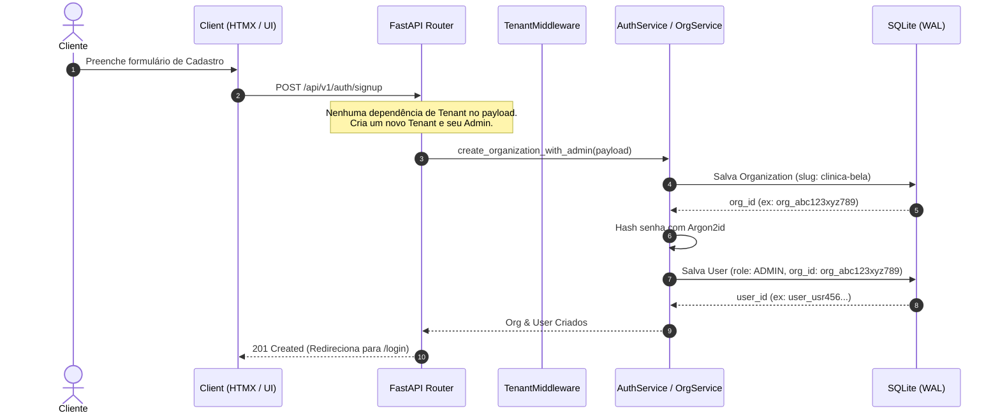
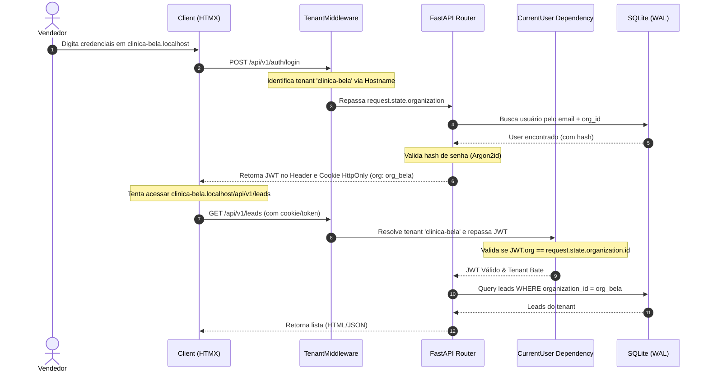

# Especificação de Autenticação, Autorização e Administração de Usuários

Este documento detalha o design estratégico e fluxo técnico de todos os processos de segurança de identidade para a Sprint 1 do **Revenue SDR OS**.

---

## 1. Processo de Sign-up (Cadastro de Tenant e Usuário)

No modelo de negócio *On-Premise-as-a-Service* (ADR-004), o deploy é feito por VPS dedicada. No entanto, o sistema deve fornecer uma interface e endpoints claros para a criação e inicialização do Tenant (Organization) e do primeiro usuário Administrador (Owner).

### Fluxo de Registro de Novo Tenant
1. **Endpoint**: `POST /api/v1/auth/signup`
2. **Payload**:
   ```json
   {
     "organization_name": "Clínica Bela",
     "tenant_slug": "clinica-bela",
     "admin_name": "Maria Silva",
     "admin_email": "admin@clinica-bela.com",
     "admin_password": "senha_segura_argon2"
   }
   ```
3. **Mecânica Interna**:
   - Criação da `Organization` no banco de dados local com o `tenant_slug` correspondente.
   - Geração automática de chaves ou inicialização dos presets de cores (ADR-013).
   - Cadastro do usuário na tabela `users` vinculado à `organization_id` recém-criada, com o papel `Role.ADMIN`.
   - Hasheamento da senha utilizando **Argon2id**.
4. **Isolamento de Banco**:
   - O e-mail do usuário é garantido como único **apenas dentro do mesmo tenant**, por meio da constraint de banco composta:
     ```sql
     UNIQUE(organization_id, email) -> uq_users_org_email
     ```
     Isso permite que um mesmo e-mail de teste seja usado em diferentes tenants em ambientes de desenvolvimento, mas mantém isolamento absoluto.
   - O ID de login do Google (`google_id`) também é isolado por tenant caso o provedor Google seja utilizado:
     ```sql
     UNIQUE(organization_id, google_id) -> uq_users_org_google_id
     ```

### Fluxo de Registro de Novo Tenant via Google (Sign-up com Google)
1. **Endpoint**: `POST /api/v1/auth/signup/google`
2. **Payload**:
   ```json
   {
     "organization_name": "Clínica Bela",
     "tenant_slug": "clinica-bela",
     "google_id_token": "eyJhbGciOiJSUzI1Ni..."
   }
   ```
3. **Mecânica Interna**:
   - O backend decodifica e valida o `google_id_token` usando as chaves públicas do Google (JWKS), garantindo que o token não expirou e foi emitido para o Client ID correto do aplicativo.
   - Extrai o e-mail (`email`), nome (`name`) e o identificador do Google (`sub` mapeado para `google_id`).
   - Cria a `Organization` com o `tenant_slug` correspondente.
   - Cria o usuário na tabela `users` vinculado à `organization_id` recém-criada, com o papel `Role.ADMIN`, `auth_provider = "google"`, `google_id` preenchido e senha nula (bloqueando logins nativos sem senha definida).

### Diagrama de Sequência: Sign-up


---

## 2. Processo de Login e Sessão (Autenticação)

O Revenue SDR OS usa um mecanismo de **Autenticação Dupla** (Double Transport) para servir tanto o frontend de hipermídia (HTMX/Alpine) quanto clientes API externos (/docs ou futuros integrações).

### Mecanismo de Token e Transporte
* **Cookie HttpOnly (`rsdros_session`)**: Precedência para navegação no navegador. Possui flags de segurança ativas: `HttpOnly`, `Secure` (em prod), `SameSite=Lax`, e `Path=/`.
* **Header Authorization (`Authorization: Bearer <JWT>`)**: Usado por clients de API e requests em `/docs`.
* **JWT Estrutura**:
  ```json
  {
    "sub": "user_usr456...",
    "org": "org_abc123xyz789",
    "type": "session",
    "jti": "jwt_uuid_random_123",
    "exp": 1784561200
  }
  ```

### Defesa em Profundidade no Login
1. O usuário envia as credenciais para `POST /api/v1/auth/login`.
2. O backend valida a senha usando Argon2id.

### Fluxo de Login via Google (Opcional)
1. **Endpoint**: `POST /api/v1/auth/login/google`
2. **Payload**:
   ```json
   {
     "google_id_token": "eyJhbGciOiJSUzI1Ni..."
   }
   ```
3. **Mecânica Interna**:
   - O middleware `TenantResolutionMiddleware` resolve a organização solicitada pelo request (`request.state.organization`).
   - O backend valida o `google_id_token` e extrai o `google_id` (`sub`) e o `email`.
   - O `AuthService` busca o usuário correspondente na organização ativa:
     - **Cenário A (Vínculo por Google ID)**: Um usuário com o `google_id` correspondente é encontrado para aquele `organization_id`. O login é concedido.
     - **Cenário B (Primeiro acesso com mesmo Email)**: Se não for encontrado por `google_id`, busca por `email` e `organization_id`. Se existir uma conta nativa com o mesmo e-mail, e as configurações do tenant permitirem a associação, o backend vincula o `google_id` a essa conta existente e atualiza o provedor para permitir login nativo ou social, concedendo o login.
     - **Cenário C (Inexistente)**: Se nenhum usuário for encontrado, retorna `401 Unauthorized` (para impedir o auto-registro não autorizado em organizações existentes).
   - Se bem-sucedido, gera o JWT de sessão (`rsdros_session` no cookie HttpOnly e no JSON de retorno) idêntico ao fluxo nativo, garantindo 100% de compatibilidade.

3. **Validação do Tenant Cruzada (Cross-Tenant)**:
   - O middleware `TenantResolutionMiddleware` resolve a organização solicitada pelo request (`request.state.organization`).
   - O `AuthService` busca o usuário correspondente ao e-mail informado **dentro daquela organização específica**.
   - Se o usuário existir em outro tenant, mas não no atual, o sistema retorna `401 Unauthorized` com a mensagem genérica `Authentication failed` para evitar vazamento de dados de outros tenants.
   - O token JWT gerado é assinado e carrega a claim `org`.
4. **Proteção em cada requisição**:
   - A dependência `CurrentUser` extrai o token (do Cookie ou Header).
   - Ela valida a assinatura do JWT.
   - **Crucial**: O `org` contido no token JWT deve bater exatamente com a organização resolvida no request (`request.state.organization.id`). Se não bater, é disparado `401 Unauthorized` imediatamente.

### Diagrama de Sequência: Login e Acesso Isolado


---

## 3. Processo de Recuperação de Senha (Forget Password)

Para garantir segurança máxima contra vazamento de e-mails de clientes (Email Enumeration Vulnerability), o fluxo de esquecimento de senha é desenhado sem expor se o usuário está ou não cadastrado na plataforma.

### Fluxo Seguro de Recuperação
1. **Solicitação**: `POST /api/v1/auth/forget-password`
   - Payload: `{"email": "vendedor@clinica-bela.com"}`
   - O `TenantResolutionMiddleware` resolve a organização ativa.
   - O backend busca o usuário por e-mail e organização.
   - **Independentemente** de encontrar o usuário ou não, a resposta é idêntica:
     ```json
     {
       "message": "If the email is registered in this organization, a recovery link has been sent."
     }
     ```
2. **Geração do Token**:
   - Se o usuário existir, o sistema gera um token de recuperação criptograficamente seguro com prefixo `pwd_rec_` (ex: `pwd_rec_7a8b9c...`).
   - O token é gravado na tabela `password_recoveries` associado ao `user_id` e `organization_id`.
   - Propriedades do Token:
     - **Tempo de vida**: Expirável em 15 minutos (`expires_at`).
     - **Uso único**: Marcado como `used: bool = False`.
3. **Disparo do E-mail**:
   - Um evento é criado ou o serviço de e-mail local envia um link com o token:
     `https://<tenant>.localhost:8000/auth/reset-password?token=pwd_rec_7a8b9c...`
4. **Redefinição**: `POST /api/v1/auth/reset-password`
   - O usuário preenche a nova senha.
   - O backend valida a existência e expiração do token de recuperação na tabela `password_recoveries`.
   - Se válido, atualiza a senha do usuário com a nova senha hasheada com Argon2id, marca o token de recuperação como usado, e invalida quaisquer outras sessões ativas daquele usuário.

### Modelo de Dados para Recuperação (`PasswordRecovery`)
```python
class PasswordRecovery(TenantMixin, table=True):
    __tablename__ = "password_recoveries"

    id: str = Field(default_factory=lambda: prefixed_id("prc"), primary_key=True)
    user_id: str = Field(foreign_key="users.id", nullable=False)
    token: str = Field(index=True, unique=True, nullable=False)
    expires_at: datetime = Field(nullable=False)
    used: bool = Field(default=False, nullable=False)
```

---

## 4. Processo de Administração de Usuários

A administração de usuários é realizada por Tenant. Nenhum usuário pode ver ou alterar informações de usuários fora do seu `organization_id`.

### Papéis e Níveis de Permissões (RBAC)
* **`Role.ADMIN`**: Acesso completo às configurações do Tenant, faturamento (VPS), logs, playbooks, e gerenciamento de usuários (criar, editar, inativar).
* **`Role.MANAGER`**: Acesso a relatórios de equipe, playbooks, leads gerais, e criação de SDRs (não pode deletar admins ou gerenciar chaves de infraestrutura).
* **`Role.SDR`**: Acesso limitado aos seus próprios leads, conversas ativas, e agenda pessoal. Não tem permissões de gerenciamento de usuários.

### Operações Administrativas (/api/v1/users)
* **Criar Usuário**: O administrador do tenant convida ou cria um novo usuário informando e-mail, nome e papel (`Role`). O `organization_id` é herdado do contexto do administrador (ContextVar/Middleware).
* **Editar Usuário**: Permite trocar o nome, idioma preferido (`preferred_locale`), e papel (apenas admins do tenant podem mudar papéis).
* **Exclusão Lógica (Soft Delete)**:
  - **Invariante**: Nunca exclua fisicamente um usuário do banco. Como o sistema é baseado em eventos append-only (timeline), remover o usuário do banco quebraria chaves estrangeiras e o histórico de ações ("SDR X enviou mensagem Y").
  - **Mecanismo**: A tabela `users` possui a coluna `status` (valores: `active`, `inactive`). Quando excluído, o status é alterado para `inactive`, bloqueando logins futuros imediatos daquela conta.

### Medidas de Isolamento Cross-Tenant
* Toda requisição em `/api/v1/users/{user_id}` valida se o `user_id` solicitado pertence ao `organization_id` resolvido do request.
* Caso pertença a outro tenant, o backend levanta um `NotFoundError` (`404 not_found`), nunca revelando que a conta existe em outro tenant.

---

## 5. Matriz de Endpoints & Controle de Acesso

| Endpoint | Método | Descrição | Permissão Mínima | Formato Resposta |
|---|---|---|---|---|
| `/api/v1/auth/signup` | `POST` | Cria nova Org + Usuário Admin | Pública | JSON |
| `/api/v1/auth/signup/google` | `POST` | Cria nova Org + Usuário Admin via Google | Pública | JSON |
| `/api/v1/auth/login` | `POST` | Autentica usuário, gera cookie + token | Pública | JSON + Cookie |
| `/api/v1/auth/login/google` | `POST` | Autentica com Google, gera cookie + token | Pública | JSON + Cookie |
| `/api/v1/auth/logout` | `POST` | Invalida o token/cookie atual | Usuário Autenticado | JSON (Clear Cookie) |
| `/api/v1/auth/forget-password` | `POST` | Solicita token de redefinição de senha | Pública | JSON |
| `/api/v1/auth/reset-password` | `POST` | Executa a alteração com token válido | Pública | JSON |
| `/api/v1/users` | `GET` | Lista usuários do Tenant atual | `Role.MANAGER` | JSON (Paginado) |
| `/api/v1/users` | `POST` | Cria novo usuário no Tenant | `Role.MANAGER` | JSON |
| `/api/v1/users/{id}` | `GET` | Detalha usuário do Tenant | `Role.SDR` (se for o próprio) ou `MANAGER` | JSON |
| `/api/v1/users/{id}` | `PUT` | Atualiza usuário (nome, locale) | `Role.SDR` (próprio) ou `MANAGER` | JSON |
| `/api/v1/users/{id}/status` | `PATCH` | Ativa/Desativa usuário (Soft Delete) | `Role.ADMIN` | JSON |
| `/api/v1/users/{id}/role` | `PATCH` | Altera papel do usuário | `Role.ADMIN` | JSON |
