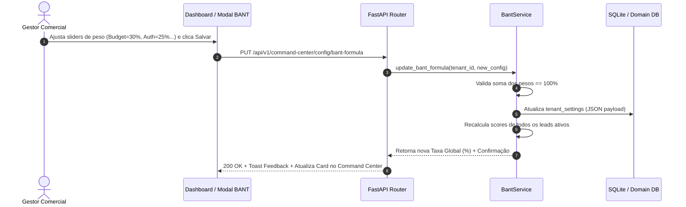

# Especificação Técnica: Telas de Detalhes, Métricas e Configuração do Command Center

Este documento especifica a arquitetura completa, contratos de dados, modelo de domínio e regras de negócio para as **telas de detalhamento, configuração de métricas, gestão de agenda/metas e construtor de fórmulas do Command Center** no **Revenue SDR OS**.

---

## 1. Visão Geral e Contexto Estratégico

O **Command Center** do Revenue SDR OS atua como o painel executivo e operacional de tomada de decisão para gerentes comerciais e SDRs. Para que as métricas apresentadas nos 4 cards estratégicos de topo deixem de ser apenas indicadores estáticos e passem a ser ferramentas acionáveis, o sistema fornece telas de drill-down analítico e painéis de configuração parametrizados.

### Os 4 Módulos de Detalhamento e Configuração

```
+-----------------------------------------------------------------------------------+
|                                COMMAND CENTER (KPIs)                              |
+---------------------+-----------------------+------------------+------------------+
|  Leads Contatados   | Qualificação (BANT)   | Reuniões (SQL)   | Pipeline MRR     |
+----------+----------+-----------+-----------+--------+---------+--------+---------+
           |                      |                    |                  |
           v                      v                    v                  v
+---------------------+ +-------------------+ +------------------+ +------------------+
|  [TODO 1: LEADS]    | |  [TODO 2: BANT]   | | [TODO 3: MEETINGS] | |  [TODO 4: MRR]   |
| - Date Range Picker | | - Score Breakdown | | - Metas por      | | - Histórico de |
| - Sync com Pipeline | | - Pesos por Pilar | |   Janela         | |   Oportunidades|
| - Tabela Analítica  | | - Nota de Corte   | | - CRUD de Slots  | | - Fórmulas de  |
| - Canais & Status   | | - Fórmula Global  | | - Sync Google/ | |   Cálculo      |
|                     | |                   | |   iCal/Outlook   | | - Probabilidades|
+---------------------+ +-------------------+ +------------------+ +------------------+
```

---

## 2. Detalhamento dos Módulos Técnicos

---

### 2.1. Módulo 1: Leads Contatados (Drill-Down & Seletor de Período Customizado)

#### Regras de Negócio e Correlação
- **Correlação de Dados**: Os registros apresentados nesta visão devem obrigatoriamente derivar da mesma base de dados indexada pelo menu **"Pipeline de Leads"**. A filtragem por tenant (`organization_id`) é rigorosamente mantida.
- **Filtros Temporais**: Suporte aos atalhos `Hoje` (00:00 às 23:59 UTC), `Semana` (segunda-feira atual até o momento) e `Mês` (dia 1 do mês vigente até hoje), acrescido do modo **`Personalizado`** com seletor de Data Inicial (`start_date`) e Data Final (`end_date`).

#### Contrato de API & Query Params
- **Endpoint**: `GET /api/v1/command-center/leads-contacted`
- **Query Parameters**:
  ```http
  GET /api/v1/command-center/leads-contacted?period=custom&start_date=2026-07-01&end_date=2026-07-23&channel=zap&stage=engajado_ia HTTP/1.1
  Host: clinica-bela.sdr-os.com
  Authorization: Bearer <jwt_token>
  ```
- **Resposta JSON Schema (`LeadsContactedDetailResponse`)**:
  ```json
  {
    "period": {
      "type": "custom",
      "start_date": "2026-07-01T00:00:00Z",
      "end_date": "2026-07-23T23:59:59Z"
    },
    "summary": {
      "total_contacted": 1248,
      "growth_percentage": 18.4,
      "response_rate_percentage": 42.1
    },
    "leads": [
      {
        "id": "lead_98a72b",
        "name": "Carlos Eduardo",
        "company": "TechMed Solutions",
        "channel": "zap",
        "pipeline_stage": "qualificado_bant",
        "bant_score": 88,
        "assigned_agent": "SDR-01 IA",
        "last_contact_at": "2026-07-23T11:45:00Z"
      }
    ]
  }
  ```

---

### 2.2. Módulo 2: Taxa de Qualificação BANT (Scores & Construtor de Fórmulas)

#### Regras de Negócio e Fórmula Parametrizada
O cálculo do Score BANT de cada lead é baseado em um modelo de média ponderada dos 4 pilares:
$$\text{Score BANT} = (w_B \cdot S_B) + (w_A \cdot S_A) + (w_N \cdot S_N) + (w_T \cdot S_T)$$
Onde:
- $w_B, w_A, w_N, w_T$: Pesos percentuais ajustáveis de **Budget**, **Authority**, **Need** e **Timeline** (soma obrigatoriamente $= 100\%$).
- $S_B, S_A, S_N, S_T$: Notas de 0 a 100 atribuídas pelo motor de IA durante a qualificação.
- **Nota de Corte (Threshold)**: Lead é classificado como SQL se $\text{Score BANT} \ge \text{CutoffScore}$ (ex: 70).
- **Taxa Global (\%)**:
$$\text{Taxa BANT (\%)} = \left( \frac{\text{Quantidade de Leads SQL}}{\text{Total de Leads Processados na Janela}} \right) \times 100$$

#### Schema de Configuração (`BantFormulaConfig`)
```json
{
  "weights": {
    "budget": 30,
    "authority": 25,
    "need": 25,
    "timeline": 20
  },
  "cutoff_score": 70,
  "auto_qualify_sql": true
}
```

#### Diagrama de Sequência: Atualização da Fórmula BANT


---

### 2.3. Módulo 3: Reuniões Agendadas SQL (Metas, Slots CRUD & Sync Externo)

#### Definição de Metas Comerciais
Permite o cadastro de metas globais e individuais por profissional comercial (SDR / AE) para as janelas `Hoje`, `Semana` e `Mês`.

#### CRUD de Slots e Disponibilidade
- **Slot Model (`SellerSlot`)**:
  - `id`: Prefixed UUID (ex: `slot_88a91c`)
  - `organization_id`: String (FK isolada por tenant)
  - `user_id`: String (ID do vendedor/SDR)
  - `start_time`: Datetime UTC
  - `end_time`: Datetime UTC
  - `status`: Enum (`AVAILABLE`, `BOOKED`, `BLOCKED`)
  - `meeting_link`: String (URL do Google Meet / Zoom)

#### Integrações de Calendário Externo
1. **Google Calendar (OAuth2 / Webhooks)**:
   - Sincronização bidirecional de eventos.
   - Endpoint de callback de atualização de slots: `POST /api/v1/integrations/google-calendar/webhook`
2. **iCal / Apple Calendar (ICS Feed)**:
   - Endpoint de exportação de Feed dinâmico: `GET /api/v1/calendar/feed.ics?token=<tenant_user_token>`
3. **Microsoft Outlook 365**:
   - Integração Graph API para mitigação de conflitos de horário.

---

### 2.4. Módulo 4: Pipeline de MRR Gerado (Histórico & Motor de Fórmulas)

#### Modos de Cálculo de MRR
O gestor pode alternar entre 3 modelos de projeção de MRR no Command Center:

1. **MRR Ponderado por Estágio ($\text{Weighted MRR}$)**:
   $$\text{Total} = \sum_{i=1}^{N} \left( \text{Valor MRR}_i \times \frac{\text{Probabilidade Estágio}_i}{100} \right) + \text{Setup Fees}$$
2. **MRR Nominal Puro ($\text{Nominal MRR}$)**:
   $$\text{Total} = \sum_{i=1}^{N} \text{Valor MRR}_i$$
3. **Contrato Anual Total (ACV - Annual Contract Value)**:
   $$\text{Total} = \sum_{i=1}^{N} (\text{Valor MRR}_i \times 12) + \text{Setup Fees}$$

#### Mapeamento Padrão de Probabilidades por Estágio
| Estágio do Funil | Probabilidade Padrão | Ajustável pelo Gestor |
|---|---|---|
| Prospecção / Novo | 10% | Sim |
| Engajado IA | 25% | Sim |
| Qualificado BANT | 50% | Sim |
| Reunião Agendada | 75% | Sim |
| Proposta Enviada | 90% | Sim |

---

## 3. Garantias de Segurança e Multi-tenancy (ADR-003 / ADR-004)

1. **Isolamento de Tenant**:
   Todas as rotas e tabelas dos 4 módulos de detalhamento filtram obrigatoriamente `organization_id = context.current_organization_id`.
2. **Auditoria de Alterações em Fórmulas**:
   Qualquer alteração na fórmula de cálculo BANT ou no método de projeção de MRR é registrada na tabela append-only `audit_logs` com o ID do gestor responsável e o timestamp UTC (`db.base.utc_now`).
3. **Resiliência de Integração de Calendário**:
   Falhas de sincronização com o Google Calendar ou Outlook geram fallback silencioso sem bloquear o uso da agenda local do Revenue SDR OS.

---

## 4. Próximos Passos de Implementação

1. **Protótipo (Frontend)**: Executar o prompt `prompts/08_Command_Center_Config_Details_Prompt.md` no workspace `01_SDR_Prototype`.
2. **Backend (FastAPI & Models)**: Criar os schemas Pydantic e endpoints REST em `app/command_center/` no repositório backend.
3. **Alembic Migration**: Gerar a migration para as tabelas `bant_formula_configs`, `seller_slots`, `meeting_goals` e `mrr_formula_configs`.
